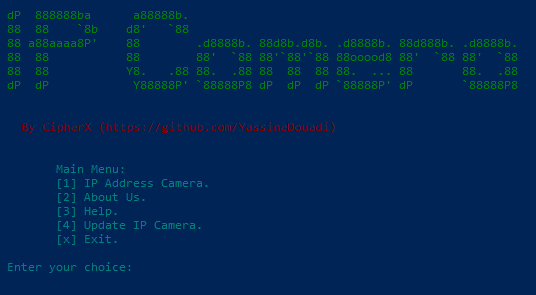

# Shodan IP Camera Search

A Python-based script that allows users to search for IP cameras using the Shodan API. The tool provides the following options for users:

1. **IP Address Camera**: Search for IP cameras in various countries.
2. **About Us**: Learn more about the script and its creator.
3. **Help**: Displays instructions on how to use the script.
4. **Update IP Camera**: A feature that will allow future updates to the IP camera search tool (currently under development).

## Features

- Search for IP cameras based on country using the Shodan API.
- View details like IP address, port, and city for each found camera.
- Learn more about the script and its creator.
- Get a help menu to understand how to use the script.

## Requirements

- Python 3.x
- `shodan` module (install via `pip install shodan`)
- `colorama` module (install via `pip install colorama`)

## Installation

1. Clone the repository:

    ```bash
    git clone https://github.com/CipherX-bit/IP_Camera.git
    ```

2. Install dependencies:

    ```bash
    pip install shodan
    pip install colorama
    ```

3. Replace the `SHODAN_API_KEY` in the `IP_Camera.py` file with your Shodan API key. You can obtain it by signing up on [Shodan](https://account.shodan.io/).

## Usage

1. Run the script:

    ```bash
    python IP_Camera.py
    ```

2. You'll be prompted with the following options:

    - **[1] IP Address Camera**: Select a country to search for IP cameras.
    - **[2] About Us**: Learn more about the script and its creator.
    - **[3] Help**: View this help guide.
    - **[4] Update IP Camera**: This feature is under development to update camera information.
    - **[x] Exit**: Exit the script.

## Screenshot

Here is a screenshot of the script in action:



## Contributing

Feel free to contribute to the project by opening issues or submitting pull requests on [GitHub](https://github.com/CipherX-bit/IP_Camera).

## License

This project is open source and available under the MIT License.

## Disclaimer

This script is for educational and research purposes only. Please use it responsibly and follow all applicable laws when querying IP cameras using the Shodan API.
